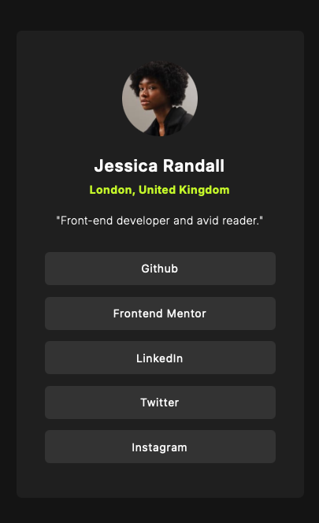

# Frontend Mentor - Social links profile solution

This is a solution to the Social links profile challenge on Frontend Mentor. Frontend Mentor challenges help you improve your coding skills by building realistic projects. 

## Overview
The page contains details of the individual and social links to their platforms. The page is responsive on different devices. The buttons are interactive. The link opens the page in a different tab of the browser. 

### Screenshot

### Links

- Solution URL: [https://github.com/Akshatasarawgi/Social-Links-Profile]
- Live Site URL: []

### Built with
- Semantic HTML5 markup
- CSS custom properties
- Flexbox
